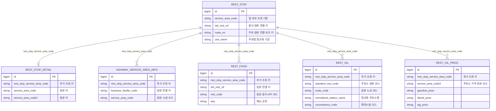

# 휴게소 내부 조회 키 설계

이 문서는 휴게소 관련 테이블을 앱 내부 조회 기준 키로 정리하기 위한 설계안이다.
실제 마이그레이션, Entity 변경, SyncService 변경은 이 문서의 후속 작업으로 진행한다.

## 배경

현재 휴게소 상세 조회는 `REST_STOP`을 기준으로 여러 원본 API 테이블을 조합한다.
문제는 테이블마다 연결 키가 다르다는 점이다.

| 연결 대상 | 현재 연결 방식 |
|---|---|
| `REST_STOP_DETAIL` | `REST_STOP.service_area_code = REST_STOP_DETAIL.service_area_code` |
| `HIGHWAY_SERVICE_AREA_INFO` | `REST_STOP.service_area_code = HIGHWAY_SERVICE_AREA_INFO.business_facility_code` |
| `REST_FOOD` | `REST_STOP.std_rest_cd = REST_FOOD.std_rest_cd` |
| `REST_OIL` | `REST_STOP.route_no = REST_OIL.route_code` + 정규화 휴게소명 일치 |
| `REST_OIL_PRICE` | `REST_OIL.standard_rest_code = REST_OIL_PRICE.service_area_code2` |

이 구조는 원본 API 보존에는 좋지만, 조회가 발생할 때마다 애플리케이션이 외부 API별
식별자 차이를 다시 해석해야 한다. 특히 주유 정보는 노선 코드, 이름 정규화, 주유소 코드까지
거쳐야 하므로 조회 서비스에 데이터 정제 책임이 남는다.

## 결정 방향

`REST_STOP.service_area_code`를 앱 내부의 휴게소 조회 기준 키로 삼는다.

컬럼명은 `rest_stop_service_area_code`를 사용한다. 길지만 다음 의도를 가장 분명하게 드러낸다.

- `service_area_code`: 외부 API 원본 필드일 수 있다.
- `rest_stop_service_area_code`: 이 row가 앱의 어느 `REST_STOP`에 귀속되는지 나타내는 내부 조회 키다.

기존 원본 API 식별자 컬럼은 삭제하지 않는다. 원본 비교, 재동기화, 문제 추적을 위해 계속 보존한다.
새 컬럼은 조회 최적화와 책임 분리를 위한 보조 키다.

## 대상 테이블

| 테이블 | 추가 컬럼 | 원본 키 유지 | 매핑 방식 |
|---|---|---|---|
| `REST_STOP_DETAIL` | `rest_stop_service_area_code` | `service_area_code`, `service_area_code2` 유지 | `REST_STOP.service_area_code = REST_STOP_DETAIL.service_area_code` |
| `HIGHWAY_SERVICE_AREA_INFO` | `rest_stop_service_area_code` | `business_facility_code`, `service_area_code` 유지 | `REST_STOP.service_area_code = HIGHWAY_SERVICE_AREA_INFO.business_facility_code` |
| `REST_FOOD` | `rest_stop_service_area_code` | `std_rest_cd`, `rest_code`, `seq` 유지 | `REST_STOP.std_rest_cd = REST_FOOD.std_rest_cd` |
| `REST_OIL` | `rest_stop_service_area_code` | `standard_rest_code`, `route_code`, `normalized_station_name` 유지 | `REST_STOP.route_no = REST_OIL.route_code` + 정규화 이름 일치 |
| `REST_OIL_PRICE` | `rest_stop_service_area_code` | `service_area_code2` 유지 | `REST_OIL.standard_rest_code = REST_OIL_PRICE.service_area_code2`로 찾은 `REST_OIL.rest_stop_service_area_code` 전파 |

`NATIONAL_OIL_PRICE`는 대상에서 제외한다. 이 테이블은 휴게소 개별 데이터가 아니라
전국 평균 유가이며, `trade_date + product_code` 기준으로 독립 조회한다.

## 관계도



## 동기화 책임

복잡한 매칭 규칙은 조회 시점이 아니라 동기화 시점에 처리한다.

### 공통 원칙

- 외부 API 응답 row는 원본 키를 그대로 저장한다.
- 동기화 서비스가 가능한 경우 `rest_stop_service_area_code`를 함께 채운다.
- 매핑 실패는 전체 동기화 실패로 보지 않는다.
- 매핑 실패 row는 저장하되 `rest_stop_service_area_code = null`로 둔다.
- 매핑 실패 건수와 대표 원인은 warn 로그 또는 sync 결과 메트릭으로 남긴다.
- 조회 API는 기본적으로 `rest_stop_service_area_code = :serviceAreaCode` 조건으로만 조회한다.

### REST_STOP_DETAIL

`REST_STOP_DETAIL.service_area_code`가 `REST_STOP.service_area_code`와 같으면
`rest_stop_service_area_code`에 같은 값을 저장한다.

이 테이블은 현재도 같은 키로 조회하므로 전환 위험이 낮다.

### HIGHWAY_SERVICE_AREA_INFO

`HIGHWAY_SERVICE_AREA_INFO.business_facility_code`가 `REST_STOP.service_area_code`와 같으면
`rest_stop_service_area_code`에 해당 값을 저장한다.

`business_facility_code`에는 `A`, `B`, `0` prefix가 섞여 있다. 현재 휴게소 상세/시설 조회에서
실제로 사용하는 행은 `REST_STOP.service_area_code`와 매칭되는 행이다. 매칭되지 않는 주유소나
기타 영업시설 row는 원본 데이터로 보존하되 휴게소 조회에서는 제외한다.

### REST_FOOD

`REST_FOOD.std_rest_cd`가 `REST_STOP.std_rest_cd`와 같으면 해당 `REST_STOP.service_area_code`를
`rest_stop_service_area_code`에 저장한다.

자연키는 기존처럼 `std_rest_cd + seq`를 유지한다. `rest_stop_service_area_code`는 조회 조건과
인덱스 용도이며, 메뉴 원본 식별자를 대체하지 않는다.

### REST_OIL

`REST_OIL`은 다음 기존 규칙으로 `REST_STOP`을 찾고, 찾은 휴게소의 `service_area_code`를
`rest_stop_service_area_code`에 저장한다.

1. `REST_STOP.route_no = REST_OIL.route_code`
2. `REST_STOP.unit_name`을 `휴게소`, `주유소`, 공백 제거 규칙으로 정규화
3. 정규화 값이 `REST_OIL.normalized_station_name`과 일치

자연키는 기존처럼 `standard_rest_code + convenience_code`를 유지한다.
한 주유소가 여러 편의시설 row를 가질 수 있으므로 `rest_stop_service_area_code`는 unique가 아니다.

### REST_OIL_PRICE

`REST_OIL_PRICE.service_area_code2`는 주유소 가격 API의 원본 코드이며,
`REST_OIL.standard_rest_code`와 연결된다.

가격 row에 `rest_stop_service_area_code`를 채우는 기본 절차는 다음과 같다.

```text
REST_OIL_PRICE.service_area_code2
  -> REST_OIL.standard_rest_code
  -> REST_OIL.rest_stop_service_area_code
  -> REST_OIL_PRICE.rest_stop_service_area_code
```

`REST_OIL_PRICE`에도 `rest_stop_service_area_code`를 저장하는 편이 좋다. 가격 조회는 앱 관점에서
"휴게소의 주유 가격"이기 때문이다. 단, 원본 가격 row의 식별자는 계속 `service_area_code2`다.

주의할 점:

- `REST_OIL_PRICE.service_area_code2`는 기존 update/upsert 기준으로 유지한다.
- `rest_stop_service_area_code`에는 일반 인덱스만 둔다.
- `rest_stop_service_area_code`에 unique 제약을 걸지 않는다.
- `REST_OIL` 매핑이 없는 가격 row는 `rest_stop_service_area_code = null`로 저장한다.
- 단건 가격 갱신 API는 `serviceAreaCode`로 휴게소를 찾은 뒤 연결된 `REST_OIL.standard_rest_code`로
  외부 가격 API를 호출하고, 저장 시 가격 row에도 `rest_stop_service_area_code`를 채운다.

## 인덱스와 제약

후속 마이그레이션에서 다음 인덱스를 추가한다.

| 테이블 | 권장 인덱스 |
|---|---|
| `REST_STOP_DETAIL` | `idx_rest_stop_detail_rest_stop_service_area_code` |
| `HIGHWAY_SERVICE_AREA_INFO` | `idx_highway_service_area_info_rest_stop_service_area_code` |
| `REST_FOOD` | `idx_rest_food_rest_stop_service_area_code` |
| `REST_OIL` | `idx_rest_oil_rest_stop_service_area_code` |
| `REST_OIL_PRICE` | `idx_rest_oil_price_rest_stop_service_area_code` |

초기에는 모든 `rest_stop_service_area_code` 컬럼을 nullable로 둔다. 외부 API에는 현재 앱의
`REST_STOP`과 매칭되지 않는 row가 존재할 수 있고, 그 row를 저장 실패로 처리하면 원본 보존
원칙과 충돌한다.

추후 실측으로 특정 테이블의 전체 매칭이 보장되면 그 테이블만 `not null` 전환을 검토한다.

## 조회 서비스 전환

`RestStopRelatedInfoQueryService`의 목표 형태는 다음과 같다.

```text
RestStopEntity restStop
  -> serviceAreaCode = restStop.getServiceAreaCode()
  -> detailRepository.findByRestStopServiceAreaCode(serviceAreaCode)
  -> highwayRepository.findAllByRestStopServiceAreaCode(serviceAreaCode)
  -> foodRepository.findAllByRestStopServiceAreaCodeOrderByIdAsc(serviceAreaCode)
  -> oilRepository.findAllByRestStopServiceAreaCodeOrderByIdAsc(serviceAreaCode)
  -> oilPriceRepository.findByRestStopServiceAreaCode(serviceAreaCode)
```

조회 서비스는 더 이상 음식의 `std_rest_cd`, 주유의 `route_no + normalized_station_name`,
가격의 `standard_rest_code = service_area_code2` 연결을 직접 계산하지 않는다.
그 규칙은 동기화와 데이터 보정 책임으로 이동한다.

## Controller/Service 기준 통일 순서

Controller path는 이미 기능별 API에서 `/api/rest-stops/{serviceAreaCode}/...` 형태를 사용한다.
따라서 path 변경보다 내부 명명과 조회 기준 통일이 우선이다.

권장 작업 순서는 다음과 같다.

1. DB 컬럼과 Entity 필드 추가
   - `rest_stop_service_area_code` nullable 컬럼 추가
   - 각 Entity에 필드와 getter 추가
   - 인덱스 추가

2. SyncService 매핑 추가
   - `REST_STOP` 목록을 기준 맵으로 만든다.
   - 상세, 시설, 음식, 주유, 가격 동기화에서 `rest_stop_service_area_code`를 채운다.
   - 매핑 실패는 저장 유지 + warn 로그로 처리한다.

3. Repository 조회 메서드 추가
   - 기존 원본 키 조회 메서드는 바로 삭제하지 않는다.
   - 새 `find...ByRestStopServiceAreaCode...` 메서드를 추가한다.

4. 조회 Service 전환
   - `RestStopRelatedInfoQueryService`를 새 조회 키 기준으로 전환한다.
   - `RestOilPriceRefreshService`의 단건 갱신 저장도 `rest_stop_service_area_code`를 채우도록 맞춘다.

5. Controller/Service 명명 정리
   - 외부 API 코드가 아닌 앱 휴게소 조회 기준은 전부 `serviceAreaCode`로 표현한다.
   - `stdRestCd`, `restCd`, `serviceAreaCode2`가 Controller 경계 밖으로 드러나는지 확인한다.
   - 내부에서 원본 코드가 필요한 경우 변수명에 `oilServiceAreaCode2`, `stdRestCd`처럼 원본 의미를 유지한다.

6. 기존 조인 fallback 제거 검토
   - 새 컬럼이 충분히 채워진 뒤, 조회 시점의 정규화 매칭 fallback을 제거한다.
   - 운영/로컬 데이터 보정이 끝나기 전에는 fallback을 임시 유지할 수 있다.

## 실패와 미매칭 처리

매핑 실패는 세 단계로 다룬다.

| 상황 | 처리 |
|---|---|
| 외부 API 호출 실패 | 기존 부분 성공 정책을 따른다. 성공한 페이지/응답은 저장한다. |
| 원본 row 저장은 가능하지만 `REST_STOP` 매핑 실패 | row를 저장하고 `rest_stop_service_area_code = null`로 둔다. |
| 조회 API에서 해당 휴게소의 부가 정보가 없음 | 빈 목록 또는 기존 응답 정책에 맞는 null/empty 응답을 반환한다. |

이렇게 하면 동기화는 원본 보존에 집중하고, 조회 API는 앱 내부 기준으로 정리된 데이터만 사용한다.

## 테스트 전략

후속 구현은 다음 테스트를 먼저 보강한 뒤 진행한다.

- 각 SyncService가 매칭 성공 시 `rest_stop_service_area_code`를 채우는지 확인한다.
- 매칭 실패 row도 저장되고, 조회 API에는 노출되지 않는지 확인한다.
- `REST_OIL_PRICE` 부분 페이지 성공 upsert에서 기존 데이터 삭제 없이 `rest_stop_service_area_code`가 유지/갱신되는지 확인한다.
- `RestStopRelatedInfoQueryService`가 원본 키 대신 `rest_stop_service_area_code` repository 메서드를 사용하는지 확인한다.
- 기존 route/detail/food/oil/facility API 응답 구조가 바뀌지 않는지 확인한다.

## 후속 작업 제안

이 설계는 한 번에 구현하지 않고 다음 단위로 나누는 것이 좋다.

1. 마이그레이션/Entity/Repository 필드 추가
2. SyncService별 `rest_stop_service_area_code` 매핑 저장
3. `RestStopRelatedInfoQueryService` 조회 기준 전환
4. `RestOilPriceRefreshService` 단건 갱신 전환
5. Controller/Service 메서드명과 테스트명 정리
6. 기존 원본 키 기반 조회 fallback 제거 여부 검토
