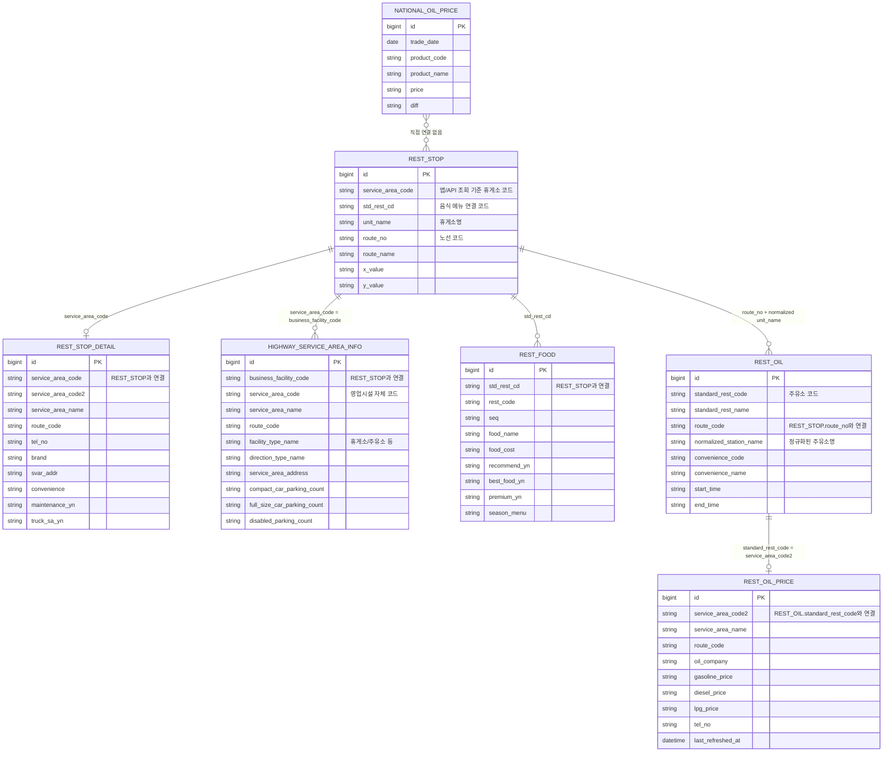

# DB 테이블 관계 다이어그램

이 문서는 휴게소 관련 테이블을 다시 볼 때 헷갈리지 않도록 현재 코드가 사용하는
연결 기준을 그림과 표로 정리한다. 아래 관계는 DB foreign key가 아니라 애플리케이션
조회 조합 규칙이다.

## 전체 관계



## 조회 기준 요약

| 기준 테이블 | 연결 테이블 | 현재 코드의 연결 조건 | 사용 위치 |
|---|---|---|---|
| `REST_STOP` | `REST_STOP_DETAIL` | `REST_STOP.service_area_code = REST_STOP_DETAIL.service_area_code` | `RestStopRelatedInfoQueryService`, 기본정보/상세 응답 |
| `REST_STOP` | `HIGHWAY_SERVICE_AREA_INFO` | `REST_STOP.service_area_code = HIGHWAY_SERVICE_AREA_INFO.business_facility_code` | `RestStopRelatedInfoQueryService`, 시설/주차 응답 |
| `REST_STOP` | `REST_FOOD` | `REST_STOP.std_rest_cd = REST_FOOD.std_rest_cd` | `RestStopRelatedInfoQueryService`, 음식 응답 |
| `REST_STOP` | `REST_OIL` | `REST_STOP.route_no = REST_OIL.route_code` + `REST_STOP.unit_name` 정규화 값과 `REST_OIL.normalized_station_name` 일치 | `RestStopRelatedInfoQueryService`, 주유 편의시설 응답 |
| `REST_OIL` | `REST_OIL_PRICE` | `REST_OIL.standard_rest_code = REST_OIL_PRICE.service_area_code2` | `RestStopRelatedInfoQueryService`, 주유 가격 응답 |
| `NATIONAL_OIL_PRICE` | 직접 연결 없음 | `trade_date + product_code` 기준으로 전국 평균 유가를 조회한다. 휴게소별 테이블과 조인하지 않는다. | 전국 유가 요약, route 응답 호환 필드 |

## REST_STOP 기준

`REST_STOP`은 현재 휴게소 조회의 중심 테이블이다. 외부 API 원본에는 여러 코드가 있지만,
앱의 휴게소 단건 API는 `service_area_code`를 path variable로 받는다.

- `service_area_code`: 기본정보, 상세, 시설 조회의 기준 코드다.
- `std_rest_cd`: 음식 메뉴(`REST_FOOD`) 연결에 사용한다.
- `route_no`: 주유 편의시설(`REST_OIL`) 연결에 사용한다.
- `unit_name`: 주유소명 매칭을 위해 `휴게소`, `주유소`, 공백을 제거한 값으로 정규화한다.

`STD_REST_CD`가 근본 키처럼 보일 수 있지만, 현재 코드의 public lookup 기준은
`SERVICE_AREA_CODE`다. 음식 메뉴는 예외적으로 `STD_REST_CD`로 직접 연결된다.

## 상세/시설 정보

`REST_STOP_DETAIL`은 `SERVICE_AREA_CODE`가 `REST_STOP.service_area_code`와 맞는 상세 테이블로
사용된다. 현재 기본정보 API는 `REST_STOP`과 `REST_STOP_DETAIL`을 조합한다.

`HIGHWAY_SERVICE_AREA_INFO`는 `business_facility_code`로 `REST_STOP.service_area_code`와
연결한다. 현재 시설/주차 API는 이 테이블의 영업시설, 방향, 주소, 주차 수 등을 사용한다.

## HIGHWAY_SERVICE_AREA_INFO prefix 메모

로컬 DB 기준으로 `HIGHWAY_SERVICE_AREA_INFO.business_facility_code`는 `A`로 시작하지 않는 값도
존재한다. 이 값들이 전부 잘못된 데이터라는 뜻은 아니다. 같은 테이블 안에 휴게소, 주유소,
그 외 영업시설 성격의 코드가 함께 들어와 있기 때문이다.

확인한 분포는 다음과 같다.

| prefix | facility_type_name | 건수 |
|---|---:|---:|
| `A` | 휴게소 | 287 |
| `B` | 주유소 | 237 |
| `0` | 휴게소 | 34 |
| `0` | 주유소 | 23 |

현재 `REST_STOP` 기준 조회에서 실제로 사용되는 행은
`REST_STOP.service_area_code = HIGHWAY_SERVICE_AREA_INFO.business_facility_code`로 매칭되는
203건이다. 그 외 `B` prefix 주유소 행이나 `0` prefix 행은 현재 휴게소 상세/시설 조회에서는
직접 사용하지 않는다.

## 음식 정보

음식 메뉴는 `REST_STOP.std_rest_cd`와 `REST_FOOD.std_rest_cd`가 직접 일치한다.
음식 API 전용 코드인 `REST_FOOD.rest_code`는 현재 조인 기준으로 사용하지 않는다.

동기화 자연키는 `std_rest_cd + seq`다. 같은 휴게소에 여러 메뉴가 있으므로
휴게소 하나가 여러 `REST_FOOD` 행을 가진다.

## 주유 정보와 가격

주유 편의시설은 휴게소 코드 하나만으로 바로 연결하지 않는다. 현재 코드는 다음 두 조건을 함께
사용한다.

1. `REST_STOP.route_no = REST_OIL.route_code`
2. `REST_STOP.unit_name`을 정규화한 값이 `REST_OIL.normalized_station_name`과 일치

정규화 규칙은 `RestOilEntity.normalizeStationName` 기준이다.

```text
휴게소 제거 -> 주유소 제거 -> 모든 공백 제거
```

주유 가격은 주유 편의시설에서 찾은 첫 번째 `REST_OIL.standard_rest_code`로 조회한다.
그 값이 `REST_OIL_PRICE.service_area_code2`와 연결된다.

```text
REST_STOP
  -> route_no + normalized unit_name
  -> REST_OIL.standard_rest_code
  -> REST_OIL_PRICE.service_area_code2
```

로컬 DB 기준으로 `REST_STOP` 203건 중 주유 가격까지 연결되는 휴게소는 164건으로 확인했다.
연결되지 않는 휴게소는 실제로 주유소가 없거나, 명칭/노선 기준 매칭 보강이 필요한 경우일 수 있다.

## 전국 평균 유가

`NATIONAL_OIL_PRICE`는 휴게소 개별 데이터가 아니다. 오피넷 전국 평균 유가를
`trade_date + product_code` 기준으로 저장한다.

이 테이블은 `REST_STOP`, `REST_OIL`, `REST_OIL_PRICE`와 직접 조인하지 않는다. route 응답에서
전국 평균 대비 차이값을 만들 때 참고 데이터로 사용하고, 별도 전국 유가 API에서도 조회한다.

## DB 확인용 쿼리

주유 가격까지 연결되는 휴게소를 확인하려면 다음 쿼리를 사용한다.

```sql
select distinct
    rs.service_area_code       as rest_stop_service_area_code,
    rs.std_rest_cd             as rest_stop_std_rest_cd,
    rs.unit_name               as rest_stop_name,
    rs.route_no                as rest_stop_route_no,
    rs.route_name              as rest_stop_route_name,
    ro.standard_rest_code      as oil_standard_rest_code,
    ro.standard_rest_name      as oil_station_name,
    rp.oil_company             as oil_company,
    rp.gasoline_price          as gasoline_price,
    rp.diesel_price            as diesel_price,
    rp.lpg_price               as lpg_price,
    rp.tel_no                  as oil_tel_no,
    rp.last_refreshed_at       as last_refreshed_at
from rest_stop rs
join rest_oil ro
  on ro.route_code = rs.route_no
 and ro.normalized_station_name =
     regexp_replace(
       replace(replace(rs.unit_name, '휴게소', ''), '주유소', ''),
       '\\s+',
       ''
     )
join rest_oil_price rp
  on rp.service_area_code2 = ro.standard_rest_code
order by
    rs.route_no,
    rs.unit_name;
```

`HIGHWAY_SERVICE_AREA_INFO` prefix와 시설 타입 분포는 다음 쿼리로 확인한다.

```sql
select
    substring(business_facility_code, 1, 1) as prefix,
    facility_type_name,
    count(*) as count
from highway_service_area_info
where business_facility_code is not null
group by substring(business_facility_code, 1, 1), facility_type_name
order by prefix, facility_type_name;
```
