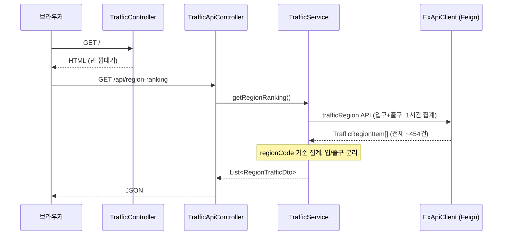
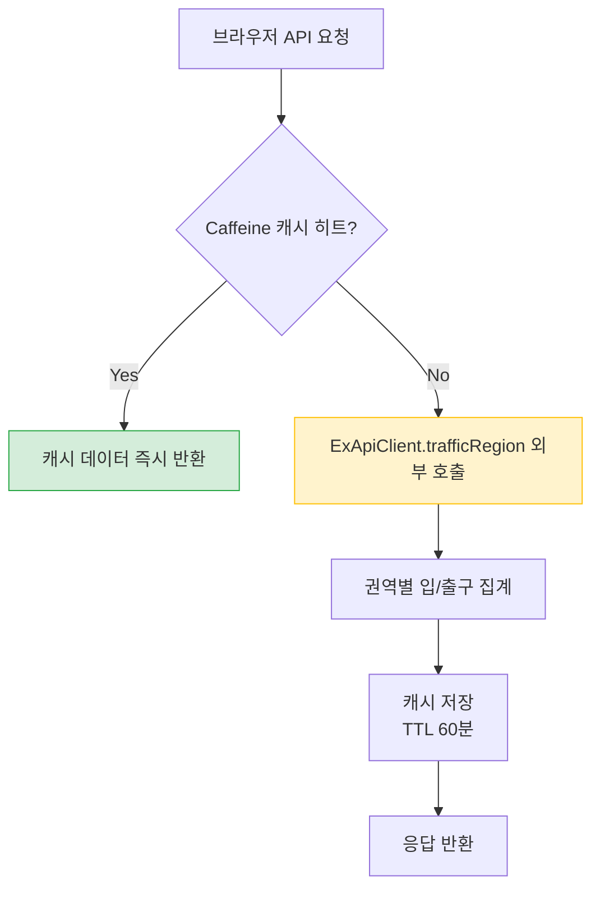

# vroom-tracker

고속도로 권역별 실시간 입/출구 교통량 대시보드.
"지금 사람들이 어디로 많이 가는지" 권역 순위로 보여주어 여행지 탐색에 활용합니다.

---

## 전체 데이터 흐름



---

## 캐싱 전략



| 캐시명 | TTL | 대상 API |
|---|---|---|
| `regionRanking` | 60분 | trafficRegion (권역별 입/출구 교통량) |
| `dashboard` | 60분 | trafficIc (영업소 랭킹 · 요약 — UI 미사용) |
| `trafficFlow` | 1일 | trafficFlowByTime (연간 통계 — DB에서 조회) |

> `trafficRegion` API의 집계 주기가 1시간이므로 TTL을 60분으로 설정합니다.
> 1시간 이전에 캐시를 갱신해도 API 응답이 동일합니다.

---

## DB 적재 흐름 (연간 통계)

```mermaid
flowchart LR
    subgraph 앱 시작 시 프론트엔드 요청
        A[GET /api/hourly-pattern/init] --> B{DB에 당해년도\n데이터 있음?}
        B -- No --> C[trafficFlowByTime\nAPI 호출 후 저장]
        B -- Yes --> D[기존 데이터 유지]
    end

    subgraph 매일 새벽 1시
        E[@Scheduled] --> F[trafficFlowByTime\nAPI 호출]
        F --> G{응답 있음?}
        G -- Yes --> H[deleteByStdYear\n후 saveAll]
        G -- No --> I[기존 데이터 유지]
    end
```

---

## 기술 스택

| 항목 | 기술 |
|---|---|
| Backend | Spring Boot 3.5.0, Java 17 |
| HTTP Client | Spring Cloud OpenFeign |
| DB | H2 (file-based) + Spring Data JPA |
| Cache | Caffeine (in-memory) |
| Frontend | Bootstrap 5, Vanilla JS (fetch API) |
| 기타 | Lombok |

---

## 사용 API (data.ex.co.kr)

| API | 엔드포인트 | 용도 | 갱신 주기 |
|---|---|---|---|
| 권역별 교통량 현황 | `/openapi/trafficapi/trafficRegion` | 권역 순위 (현재 UI 주력) | 1시간 집계 |
| 톨게이트 입/출구 교통량 | `/openapi/trafficapi/trafficIc` | 영업소 랭킹 · 요약 (백엔드 구현, UI 미사용) | 15분 집계 |
| 시간대별 교통량 현황 | `/openapi/specialAnal/trafficFlowByTime` | 시간대 패턴 (DB 저장 후 조회) | 연간 통계 |

### 주요 파라미터

**trafficRegion**
- 필터 없음 (입구·출구 전체 조회), `tmType=3` (1시간 집계)
- 응답 필드: `regionCode`, `regionName`, `trafficAmount`(대), `inoutType`(0=입구, 1=출구), `sumDate`, `sumTm`

**trafficIc**
- `inoutType=1` (출구), `tmType=2` (15분 집계)
- 응답 필드: `unitCode`, `unitName`, `trafficAmount`(대), `sumTm`, `exDivName`

**trafficFlowByTime**
- `iStdYear` (기준년)
- 응답 필드: `stdHour`, `trfl`(교통량), `sphlDfttNm`(특수일구분명)

---

## 화면 구성

```
[ 권역별 교통량 순위 테이블 ]  ← /api/region-ranking 비동기 로드
  순위 | 권역 | 입구 교통량 | 출구 교통량 | 막대그래프 | 집계시간

[ 자동 갱신 카운트다운 (1시간) ]
```

---

## 로컬 실행 방법

### 1. API 키 설정

`src/main/resources/application-local.properties` 파일:
```properties
ex.api.key=YOUR_API_KEY_HERE
```

### 2. 실행

```bash
./gradlew bootRun
```

`http://localhost:8080` 접속

---

## 혼잡도 기준

영업소 랭킹(`trafficIc` 기반)에서 사용합니다. 현재 UI에서는 표시되지 않습니다.

| 수준 | 교통량 | 표시 |
|---|---|---|
| 많음 | 5.0대 이상 | 빨간색 |
| 보통 | 2.0 ~ 4.9대 | 노란색 |
| 적음 | 2.0대 미만 | 초록색 |

> 임계값은 `CongestionLevel.java` enum 상수(`HIGH(5.0)`, `MEDIUM(2.0)`)를 수정하세요.

---

## 프로젝트 구조

```
src/main/java/com/vroomtracker/
├── config/
│   └── CacheConfig.java              # Caffeine TTL 설정
├── controller/
│   ├── TrafficController.java         # GET / → HTML 서빙
│   └── TrafficApiController.java      # GET /api/* → JSON REST
├── service/
│   ├── TrafficService.java            # 실시간 교통량 가공, @Cacheable
│   └── TrafficFlowService.java        # 연간 통계 DB 조회/갱신
├── scheduler/
│   └── TrafficFlowScheduler.java      # 매일 새벽 데이터 갱신
├── client/
│   ├── ExApiClient.java               # Feign Client
│   ├── InoutType.java                 # 입/출구 구분 Enum
│   ├── TmType.java                    # 집계시간 구분 Enum
│   └── response/                      # 외부 API 응답 VO
│       ├── TrafficIcResponse.java / TrafficIcItem.java
│       ├── TrafficRegionResponse.java / TrafficRegionItem.java
│       └── TrafficFlowResponse.java / TrafficFlowItem.java
├── domain/
│   ├── CongestionLevel.java           # 혼잡도 Enum (임계값 + 라벨 포함)
│   └── TrafficFlowEntity.java         # 연간 통계 JPA Entity
├── repository/
│   └── TrafficFlowRepository.java
├── dto/
│   ├── RegionTrafficDto.java          # 권역 순위 뷰 모델
│   ├── TollGateTrafficDto.java        # 영업소 랭킹 뷰 모델
│   ├── NationwideTrafficDto.java      # 요약 카드 뷰 모델
│   ├── DashboardData.java             # 요약 + 랭킹 묶음
│   └── TrafficFlowDto.java            # 시간대별 패턴 뷰 모델
├── util/
│   └── TrafficUtils.java              # parseAmount, formatSumTm 정적 유틸
└── VroomTrackerApplication.java
```
