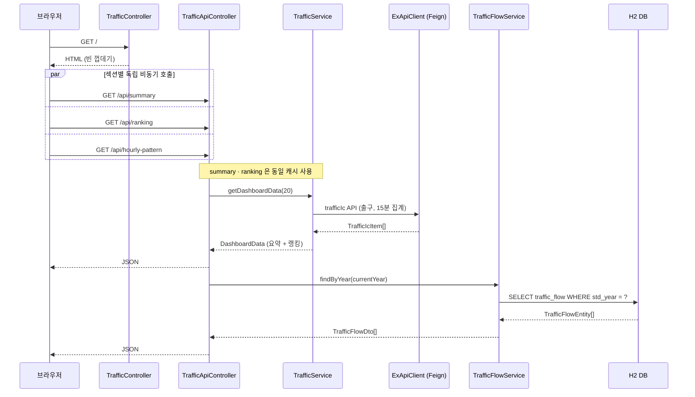
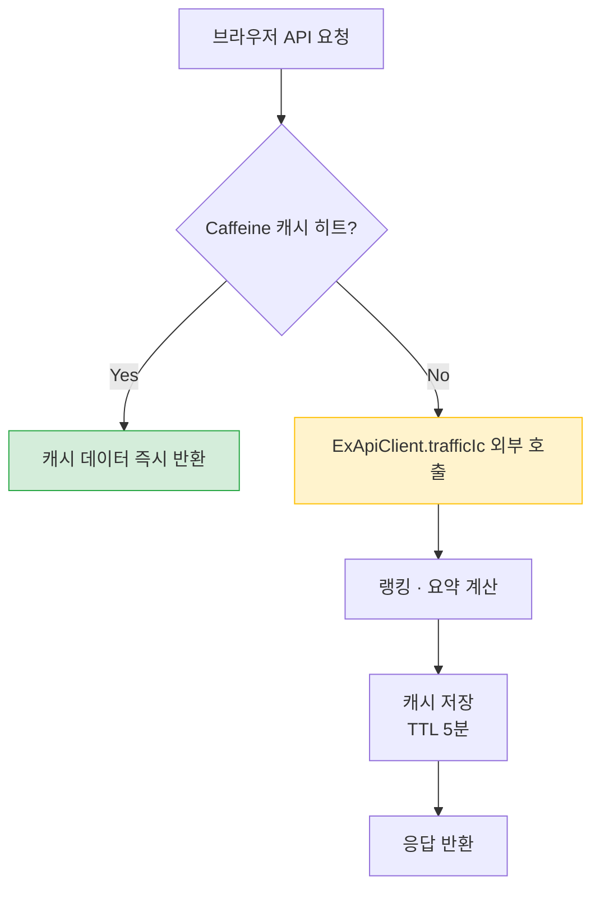

# vroom-tracker

고속도로 톨게이트별 실시간 출구 교통량 대시보드.
"지금 사람들이 어디로 많이 가는지" 랭킹으로 보여주어 여행지 탐색에 활용합니다.

---

## 전체 데이터 흐름



---

## 캐싱 전략



| 캐시명 | TTL | 대상 API |
|---|---|---|
| `dashboard` | 5분 | trafficIc (실시간 랭킹·요약) |
| `trafficFlow` | 1일 | trafficFlowByTime (연간 통계) |

> `/api/summary`와 `/api/ranking`은 같은 캐시를 공유합니다.
> 두 API를 동시에 호출해도 외부 API 실제 호출은 1회입니다.

---

## DB 적재 흐름 (연간 통계)

```mermaid
flowchart LR
    subgraph 앱 시작
        A[@PostConstruct] --> B{DB에 당해년도\n데이터 있음?}
        B -- No --> C[trafficFlowByTime\nAPI 호출 후 저장]
        B -- Yes --> D[기존 데이터 유지]
    end

    subgraph 매일 새벽 1시
        E[@Scheduled] --> F[trafficFlowByTime\nAPI 호출]
        F --> G{응답 있음?}
        G -- Yes --> H[deleteByStdYear\n후 saveAll]
        G -- No --> I[기존 데이터 유지]
    end
```

---

## 기술 스택

| 항목 | 기술 |
|---|---|
| Backend | Spring Boot 3.5.0, Java 17 |
| HTTP Client | Spring Cloud OpenFeign |
| DB | H2 (in-memory) + Spring Data JPA |
| Cache | Caffeine (in-memory) |
| Frontend | Bootstrap 5, Vanilla JS (fetch API) |
| 기타 | Lombok |

---

## 사용 API (data.ex.co.kr)

| API | 엔드포인트 | 용도 | 갱신 주기 |
|---|---|---|---|
| 톨게이트 입/출구 교통량 | `/openapi/trafficapi/trafficIc` | 메인 랭킹 + 요약 카드 | 15분 집계 |
| 시간대별 교통량 현황 | `/openapi/specialAnal/trafficFlowByTime` | 시간대 패턴 테이블 | 연간 통계 |

> API 키는 [data.ex.co.kr](https://data.ex.co.kr) 에서 발급받아야 합니다.

### 주요 파라미터

**trafficIc**
- `inoutType=1` (출구), `tmType=2` (15분 집계), `numOfRows=500`
- 응답 필드: `unitCode`, `unitName`, `trafficAmount`(만대), `sumTm`, `exDivName`

**trafficFlowByTime**
- `iStdYear` (기준년)
- 응답 필드: `stdHour`, `trfl`(교통량), `sphlDfttNm`(특수일구분명)

---

## 화면 구성

```
[ 상단 요약 카드 3개 ]  ← /api/summary 비동기 로드
  전국 출구 교통량 합계 | 혼잡 영업소 수 | 가장 붐비는 영업소

[ 메인 랭킹 테이블 ]    ← /api/ranking 비동기 로드
  순위 | 영업소 | 구분(도공/민자) | 출구 교통량 | 혼잡도 | 막대그래프 | 집계시간

[ 영업소명 검색 필터 ]
  텍스트 입력으로 영업소명 필터링

[ 시간대별 교통량 패턴 ] ← /api/hourly-pattern 비동기 로드
  현재 시간대 강조 표시

[ 자동 갱신 카운트다운 (5분) ]
```

---

## 로컬 실행 방법

### 1. API 키 설정

`src/main/resources/application-local.properties` 파일:
```properties
ex.api.key=YOUR_API_KEY_HERE
```

### 2. 실행

```bash
./gradlew bootRun
```

`http://localhost:8080` 접속

---

## 혼잡도 기준

| 수준 | 교통량 (만대) | 표시 |
|---|---|---|
| 많음 | 5.0 이상 | 빨간색 |
| 보통 | 2.0 ~ 4.9 | 노란색 |
| 적음 | 2.0 미만 | 초록색 |

> 실제 데이터 확인 후 `TrafficService.java`의 `HIGH_THRESHOLD`, `MEDIUM_THRESHOLD` 상수를 조정하세요.

---

## 프로젝트 구조

```
src/main/java/com/vroomtracker/
├── config/
│   └── CacheConfig.java              # Caffeine TTL 설정
├── controller/
│   ├── TrafficController.java         # GET / → HTML 서빙
│   └── TrafficApiController.java      # GET /api/* → JSON REST
├── service/
│   ├── TrafficService.java            # 실시간 교통량 가공, @Cacheable
│   └── TrafficFlowService.java        # 연간 통계 DB 조회/갱신
├── scheduler/
│   └── TrafficFlowScheduler.java      # 매일 새벽 데이터 갱신
├── client/
│   └── ExApiClient.java               # Feign Client + 응답 타입
├── domain/
│   └── TrafficFlowEntity.java         # 연간 통계 JPA Entity
├── repository/
│   └── TrafficFlowRepository.java
├── dto/
│   ├── TollGateTrafficDto.java        # 랭킹 테이블 뷰 모델
│   ├── NationwideTrafficDto.java      # 요약 카드 뷰 모델
│   └── TrafficFlowDto.java            # 시간대별 패턴 뷰 모델
└── VroomTrackerApplication.java
```

---

## 주의사항

- `trafficIc` 응답 배열 필드명이 `list`가 아닐 수 있습니다. 실제 응답 확인 후 `ExApiClient.TrafficIcResponse`의 `@JsonProperty`를 수정하세요.
- `trafficAmout` (오타)는 API 문서 원문 그대로입니다. 실제 응답 키가 다를 경우 `ExApiClient.TrafficAllItem`의 `@JsonProperty`를 수정하세요.
- 노선명은 API에서 제공되지 않습니다. 영업소명 텍스트 검색으로 대체합니다.
